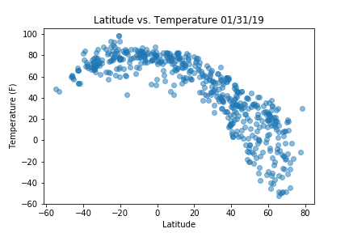
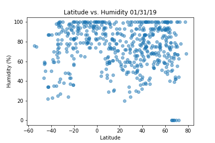
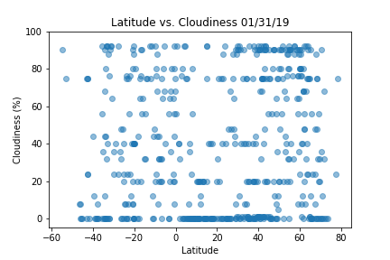
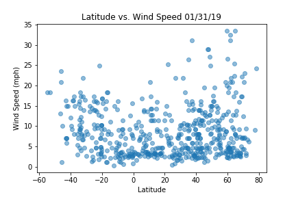

# WeatherPy

### Analysis
The following analysis randomly selects 500+ cities of varying distance from the equator and gathers data on the Temperature, Humidity, Cloudiness, and Wind Speed in each city. Each of those variables is tested to see if there is any pattern with the location's distance from the equator. 

- Of the observed variables, Temperature is most closely correlated with distance from the equator.

- There is no observable trend between Latitude and Wind Speed or Cloudiness.

- It would take deeper analysis to draw a conclusion on the correlation between Latitude and Humidity. There appears to be a patterns but it is not very discernable and would take several rounds of random data and perhaps a regression analysis.

### Visualizations

There are 4 plots that are created with matplotlib and saved as .png files. 

- Temperature (F) vs. Latitude

- Humidity (%) vs. Latitude

- Cloudiness (%) vs. Latitude

- Wind Speed (mph) vs. Latitude

The data used is also saved as a .csv file so you can verify which cities were selected each time. 